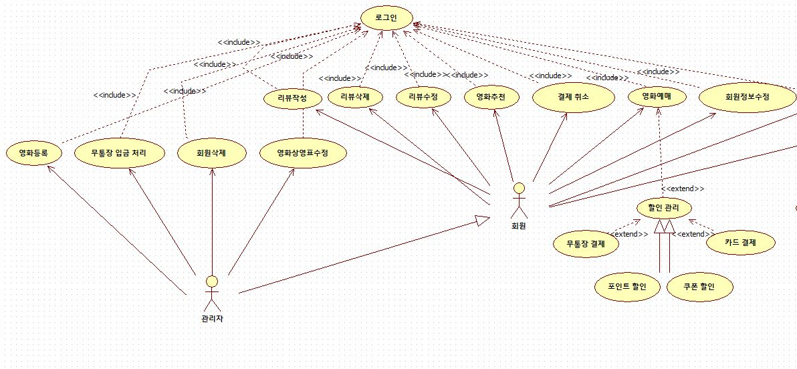
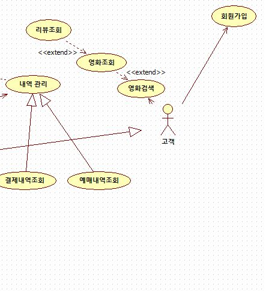
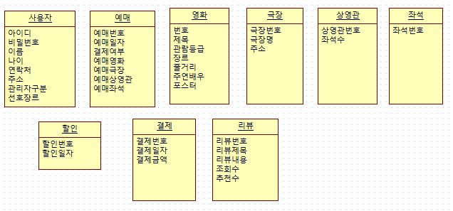
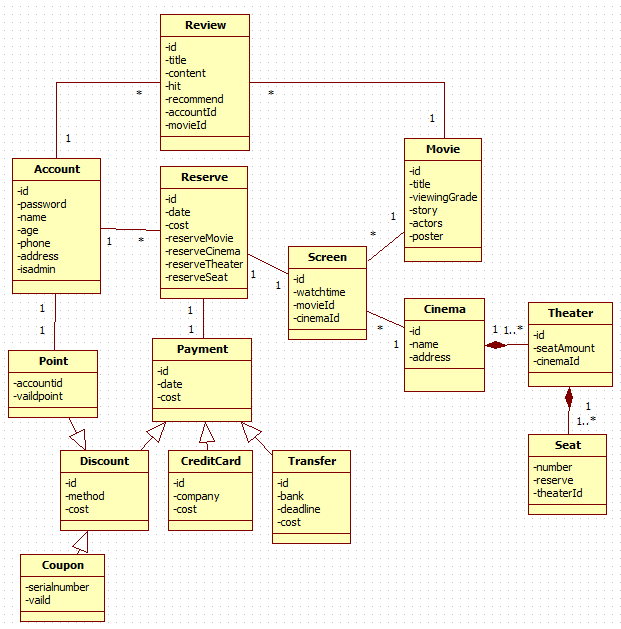

# OOD refactoring

객체지향설계(Object Oriented Design) 프로젝트 리펙토링

```
이 repository는 2017년도 가을학기 객체지향설계를 수강하고 나온 결과물을 Spring framework로 다시 구현하기 위한 repository입니다.

객체지향설계 팀 프로젝트에서 예매 시스템 중 영화 예매 시스템으로 팀 프로젝트를 하였지만 당시 콘솔로 구현한 것이 끝이였기 때문에 최근에 익힌 Spring framework를 이용하여 당시 설계했던 영화 예매 시스템을 구현하는 것이 목표입니다.
```

> # Environment
> - JDK 1.8.0_171
> - Spring 4.3.4
> - tomcat server 8.0
> - MySQL 8.0.11
> - MyBatis 3.4.6
> - Eclipse Oxyzen

## 기획

> 영화 예매 사이트가 없어 오직 오프라인으로 예매 할 수 밖에 없음을 가정하였습니다.

### 문제점

```
최근 국내 영화시장의 성장이 거세다. 올해도 송강호, 유해진 주연의 ‘택시운전사’가 천만관객을 돌파하는 등 매년 천만관객영화를 만들어내며 관객을 영화관으로 이끌고 있다. 이렇듯 영화관객의 수요가 높아지고 있지만 한편으로는 불만, 원성도 거세게 일고 있다. 영화관 매표소의 줄이 너무 길어 영화시간에 못 맞추거나 관람등급에 혼선이 생겨 오류가 생기는 경우, 각 영화관의 영화 정보를 조회 할 수 없는 등 관객의 불편함이 불만의 원인이다. 이런 주요 원인은 영화예매시스템의 부재로 판단되며 그 중요성 또한 더더욱 커지고 있다.

이처럼 모든 이해관계자들이 관객을 편리하게 영화관으로 유인할 수 있는 예매시스템의 필요성을 절실히 느끼고 있다. 따라서 관객의 불만사항과 영화관 관계자의 요구사항을 충족시킬 수 있는 예매시스템의 개발이 필요하다.
```

### 연구개발 목표

```
관객의 입장에서 현 상황의 불만사항을 계속 파악하면서 관객의 불만을 해소할 수 있는 시스템을 만들 것이다. 예를 들어, 영화 예매 시스템은 기본적으로 영화예매를 편리하게 만들기 위한 시스템이다. 이로써 관객들은 자신이 원하는 시간대가 있는지 영화관 정보, 상영시간을 통해 파악할 수 있을 것이다. 이는 관객이 영화관에서 티켓을 끊는 수고를 덜 수 있을 것으로 예상한다. 이와 같이 관객의 불만 사항을 파악함으로써 관객이 영화관에서 영화에 집중할 수 있도록 만들어야 할 것이다.

또한, 예매 시스템을 이용하여 영화 시간을 관리하는 영화관의 요구사항도 고려해야한다. 예매 시스템에 들어가는 영화 종류 및 상영 시간 등은 관객이 아닌 영화관 관계자가 조정하고 관리해야하기 때문이다.

이렇게 관객의 불만사항을 우선적으로 해결 할 수 있으면서 영화관의 각종 요구사항을 예매시스템에 포함시켜 관객의 불편함과 수고를 덜어주고 영화관이 관객 관리에 더욱 수월하게 만드는 것이 이번 시스템개발의 목표이다.
```

## 요구사항분석 및 시나리오

### 요구사항을 토대로 나온 Use-Case Diagram





### 기능

  1. 영화관리 기능

   * 영화 예매

  ```
  initiator : 회원
  supporters :
  pre-condition : 회원이 로그인한 상태
  post-condition : 할인 기능 실행

  시나리오
  1. 영화 예매 버튼을 클릭한다.
  2. 시스템은 회원에게 예매할 영화를 고르도록 영화 선택 창을 보여준다.
  3. 예매할 영화를 선택한다.
  4. 시스템은 회원 선택한 영화의 상영관 및 상영 시간대를 고를 수 있도록 상영관 및 시간대 선택 창을 보여준다.
  5. 원하는 상영관과 시간대를 선택한다.
  6. 시스템은 회원이 선택한 상영관의 시간대에 해당하는 좌석표를 보여준다.
  7. 원하는 좌석을 선택한다.
  8. 시스템은 회원에게 선택한 영화, 상영관, 시간대, 좌석번호를 보여준 후 결제 여부를 묻는 경고창을 띄운다.
  9. 확인을 누른다.

  대안흐름

  A1) 예매 도중 취소를 누르는 경우
    회원에게 초기페이지로 이동시킨다.

  예외흐름

  E1) 아무 선택 없이 확인을 누르는 경우
    해당 항목(영화, 상영관, 시간대, 좌석)을 선택하라는 경고창을 회원에게 띄운다.

  E2) 로그인이 되어있지 않은 경우
    고객에게 로그인 페이지로 이동시킨다.
  ```

   * 영화 검색

  ```
   initiator : 고객
   supporters :
   pre-condition :
   post-condition :

   시나리오
   1. 검색하고자 하는 영화의 제목을 검색한다.
   2. 시스템은 검색 내용에 알맞는 영화 목록을 검색결과로 회원에게 보여준다.

   대안흐름

   예외흐름

   E1) 검색 내용이 없는 경우
    검색이 실행 되지 않는다.
  ```

   * 영화 조회

   ```
    initiator : 고객
    supporters :
    pre-condition : 영화 검색이 끝난 상태
    post-condition :

    시나리오
    1. 검색한 영화 목록 중 관심있는 영화 하나를 선택한다.
    2. 시스템은 선택한 영화에 대한 상세정보를 고객에게 보여준다.

    대안흐름

    예외흐름

   ```

   * 영화 추천

   ```
   initiator : 회원
   supporters :
   pre-condition : 회원이 로그인 한 상태
   post-condition :

   시나리오
   1. 영화 추천을 클릭한다.
   2. 시스템은 회원에게 추천하는 영화를 보여준다.

   대안흐름

   예외흐름

   ```

   * 영화 등록

   ```
   initiator : 관리자
   supporters :
   pre-condition : 관리자가 로그인 한 상태
   post-condition :

   시나리오
   1. 영화 등록 버튼을 클릭한다.
   2.

   대안흐름
   A1) 취소 버튼을 부르는 경우
    영화 등록을 취소하고 초기페이지로 이동시킨다.

   예외흐름

   ```

  2. 리뷰관리 기능

   * 리뷰 작성

   ```
   initiator : 회원
   supporters :
   pre-condition : 회원이 로그인 한 상태, 어떤 영화를 조회하고 있는 상태, 회원의 예매내역에 해당 영화가 있는 상태
   post-condition : 회원이 작성한 리뷰가 화면에 로드된다.

   시나리오
   1. 리뷰작성 버튼을 클릭한다.
   2. 시스템은 리뷰 작성을 위한 페이지를 회원에게 보여준다.
   3. 리뷰를 작성한다.
   4. 확인 버튼을 누른다.

   대안흐름
   A1) 취소 버튼을 누르는 경우
    작성을 취소하고 이전 페이지로 이동한다.

   예외흐름
   E1) 회원의 리뷰가 10자를 넘지 않는 경우
    작성된 글이 짧다는 경고창을 보여주고 작성 칸으로 돌아간다.
   ```

   * 리뷰 조회

   ```
   initiator : 고객
   supporters :
   pre-condition : 어떤 영화를 조회하고 있는 상태
   post-condition :

   시나리오
   1. 리뷰조회 버튼을 클릭한다.
   2. 시스템은 해당 영화의 리뷰 리스트를 고객에게 보여준다.

   대안흐름

   예외흐름
   ```

   * 리뷰 삭제

   ```
   initiator : 회원
   supporters :
   pre-condition : 회원이 로그인 한 상태, 회원이 작성한 리뷰를 조회하고 있는 상태
   post-condition :

   시나리오
   1. 리뷰삭제 버튼을 클릭한다.
   2. 시스템은 삭제 확인 경고창을 페이지에 보여준다.
   3. 확인 버튼을 누른다.

   대안흐름
   A1) 취소 버튼을 누르는 경우
    '리뷰 삭제'가 취소되고 해당 리뷰 페이지로 이동한다.

   예외흐름

   ```

  3. 할인 기능

   * 포인트 할인

  ```
   initiator : 회원
   supporters :
   pre-condition : 회원이 로그인한 상태, 영화 예매 후 할인 및 결제를 실행한다.
   post-condition : 회원이 결제 기능을 실행한다.

   시나리오
   1. 포인트할인 버튼을 클릭한다.
   2. 시스템은 포인트 할인을 위한 페이지를 회원에게 보여준다.
   3. 적용하려는 포인트를 선택 후 할인에 사용할 포인트의 액수를 입력한다.
   4. 시스템은 적힌 포인트의 액수만큼 결제 금액에서 차감한다.

   대안흐름
   A1) 할인을 적용하지 않는 경우
    결제 기능을 실행한다.

   E1) 사용하려는 포인트가 부족한 경우
    '포인트가 부족합니다'는 경고창을 보여준 뒤, 다시 포인트 할인 기능을 실행한다.

   E2) 포인트 입력을 하지 않은 경우
    '할인에 사용할 포인트를 입력해주세요' 경고창을 보여준 뒤, 포인트 입력 창으로 이동한다.
  ```

   * 쿠폰 할인

   ```
   initiator : 회원
   supporters :
   pre-condition : 회원이 로그인한 상태, 영화 예매 후 할인 및 결제를 실행한다.
   post-condition : 회원이 결제 기능을 실행한다.

   시나리오
   1. 쿠폰할인 버튼을 클릭한다.
   2. 시스템은 쿠폰 할인을 위한 페이지를 회원에게 보여준다.
   3. 할인에 사용할 쿠폰을 선택 후 적용버튼을 누른다.
   4. 시스템은 쿠폰의 액수만큼 결제 금액에서 차감한다.

   대안흐름
   A1) 할인을 적용하지 않는 경우
    결제 기능을 실행한다.

   예외흐름
   E1) 쿠폰이 유효하지 않은 경우
    '포인트가 부족합니다'는 경고창을 보여준 뒤, 다시 포인트 할인 기능을 실행한다.

   E2) 쿠폰번호 입력을 하지 않은 경우
    '할인에 사용할 포인트를 입력해주세요' 경고창을 보여준 뒤, 포인트 입력 창으로 이동한다.
   ```

  4. 결제 기능

   * 무통장 결제

   ```
   initiator : 회원
   supporters :
   pre-condition : 회원이 로그인한 상태, 영화 할인 완료
   post-condition :

   시나리오
   1. 무통장 결제 버튼을 클릭한다.
   2. 시스템은 무통장 결제을 위한 페이지를 회원에게 보여준다.
   3. 입금할 은행을 선택한다.
   4. 각종 동의 사항에 체크하고 결제 버튼을 누른다.
   5. 시스템은 회원에게 회원이 선택한 은행의 임시 계좌번호와 함께 입금 기한을 보여준다.

   대안흐름
   A1) 취소 버튼을 누르는 경우
    해당 결제를 취소하고 초기 페이지로 이동한다.

   예외흐름
   E1) 입금 은행 선택을 하지 않은 경우
    '입금할 은행을 선택해 주세요' 경고창을 보여준 뒤 은행 선택 창으로 이동한다.
   ```

   * 카드 결제

   ```
   initiator : 회원
   supporters :
   pre-condition : 회원이 로그인한 상태, 영화 할인 완료
   post-condition :

   시나리오
   1. 카드 결제 버튼을 클릭한다.
   2. 시스템은 카드 결제을 위한 페이지를 회원에게 보여준다.
   3. 결제할 카드사를 선택한다.
   4. 각종 동의 사항에 체크하고 결제 버튼을 누른다.
   5. 시스템은 회원에게 결제 페이지를 보여준다.
   6. 결제사항을 확인하고 결제버튼을 누른다.

   대안흐름
   A1) 취소 버튼을 누르는 경우
    해당 결제를 취소하고 초기 페이지로 이동한다.

   예외흐름
   E1) 결제사를 선택하지 않은 경우
    '결제할 카드 회사를 선택해 주세요' 경고창을 보여준 뒤 선택 창으로 이동한다.
   ```

   * 결제 취소

   ```
   initiator : 회원
   supporters :
   pre-condition : 회원이 로그인한 상태, 영화 결제 완료, 결제 내역 조회 상태
   post-condition :

   시나리오
   1. 결제 취소 버튼을 클릭한다.
   2. 시스템은 해당 결제가 취소할 결제인지 확인하는 창을 보여준다.
   3. 확인 버튼을 누른다.

   대안흐름
   A1) 취소 버튼을 클릭하는 경우.
    '결제 취소'를 취소하고 '결제내역조회' 페이지로 이동한다.

   예외흐름
   ```

   * 무통장 입금 처리 (관리자)

   ```
   initiator : 회원
   supporters :
   pre-condition : 회원이 로그인한 상태, 영화 할인 완료
   post-condition :

   시나리오
   1. 카드 결제 버튼을 클릭한다.
   2. 시스템은 카드 결제을 위한 페이지를 회원에게 보여준다.
   3. 결제할 카드사를 선택한다.
   4. 각종 동의 사항에 체크하고 결제 버튼을 누른다.
   5. 시스템은 회원에게 결제 페이지를 보여준다.
   6. 결제사항을 확인하고 결제버튼을 누른다.

   대안흐름
   A1) 취소 버튼을 누르는 경우
    해당 결제를 취소하고 초기 페이지로 이동한다.

   예외흐름
   E1) 결제사를 선택하지 않은 경우
    '결제할 카드 회사를 선택해 주세요' 경고창을 보여준 뒤 선택 창으로 이동한다.
   ```

   * 무통장 입금 처리

   ```
   initiator : 관리자
   supporters :
   pre-condition : 관리자가 로그인한 상태
   post-condition : 해당 회원의 예매 처리가 완료된다.

   시나리오
   1. 무통장 입금 처리 버튼을 클릭한다.
   2. 시스템은 '입금 대기중'인 회원들의 예매 목록을 페이지에 보여준다.
   3. 해당 회원의 예매 리스트에 '입금 확인' 버튼을 누른다.

   대안흐름    
   A1) 취소 버튼을 누르는 경우
    '무통장 입금 처리'를 취소하고 초기페이지로 이동한다.

   예외흐름

   ```

  5. 내역 관리 기능

   * 예매 내역 조회

   ```
   initiator : 회원
   supporters :
   pre-condition : 회원이 로그인한 상태
   post-condition :

   시나리오
   1. 예매내역조회 버튼을 클릭한다.
   2. 시스템은 회원의 예매 내역을 회원에게 보여준다.

   대안흐름

   예외흐름

   ```

  6. 회원 관리 기능

   * 회원가입

   ```
   initiator : 고객
   supporters :
   pre-condition :
   post-condition :

   시나리오
   1. 회원가입 버튼을 클릭한다.
   2. 시스템은 회원가입 페이지를 고객에게 보여준다.
   3. 회원가입에 필요한 각종 정보를 입력한다.
   4. 확인버튼을 누른다.

   대안흐름
   A1) 취소 버튼을 누르는 경우
    '회원가입' 기능을 취소하고 초기페이지로 이동한다.

   예외흐름
   E1) 아이디가 중복되는 경우
    아이디가 중복된다는 경고창을 보여주고 다시 아이디를 입력하도록 입력창으로 이동한다.

   E2) 필수 정보를 입력하지 않는 경우
    필수 정보 입력이 되지 않았다는 표시를 해주고 정보 입력을 하도록 입력창으로 이동한다.

   E3) 입력 양식에 어긋나는 정보를 입력한 경우
    입력 양식에 맞지 않다는 표시와 함께 다시 입력하도록 입력창으로 이동한다.
   ```

   * 로그인

  ```
   initiator : 회원, 관리자
   supporters :
   pre-condition :
   post-condition :

   시나리오
   1. 로그인 창에 회원의 아이디 및 비밀번호를 입력한다.
   2. 로그인 버튼을 누른다.

   대안흐름

   예외흐름
   E1) 아이디 또는 비밀번호가 일치하지 않는 경우
    아이디 / 비밀번호가 일치하지 않는다는 경고창을 보여주고 로그인 페이지로 이동한다.
  ```

   * 회원정보수정

```
   initiator : 회원, 관리자
   supporters :
   pre-condition : 회원 또는 관리자가 로그인 된 상태
   post-condition :

   시나리오
   1. 회원정보수정 버튼을 누른다.
   2. 시스템은 현재 저장되어있는 정보를 화면에 보여준다.
   3. 수정하고자하는 정보를 입력한다.
   4. 확인 버튼을 누른다.

   대안흐름
   A1) 취소 버튼을 누를 경우
    입력을 취소하고 초기페이지로 돌아간다.

   예외흐름
   E1) 수정 내용을 입력하지 않은 경우
    수정할 내용이 입력되지 않았다는 경고창을 보여준 후 회원정보수정 페이지로 되돌아간다.
```

   * 회원 탈퇴

```
   initiator : 회원, 관리자
   supporters :
   pre-condition : 회원 또는 관리자가 로그인 된 상태, 회원정보수정 페이지를 띄운 상태
   post-condition :

   시나리오
   1. 회원탈퇴 버튼을 누른다.
   2. 시스템은 확인 절차로 비밀번호 입력 창을 보여준다.
   3. 비밀번호를 입력하고 확인 버튼을 누른다.

   대안흐름
   A1) 취소 버튼을 누를 경우
    입력을 취소하고 회원정보수정 페이지로 돌아간다.

   예외흐름
   E1) 비밀번호가 틀릴 경우
    비밀번호가 틀리다는 경고창과 함께 회원정보수정 페이지로 돌아간다.
```

   7. 영화상영표 수정

```
   initiator : 관리자
   supporters :
   pre-condition : 관리자가 로그인 된 상태
   post-condition : 수정된 영화상영표가 나타난다.

   시나리오
   1. 영화상영표 수정 버튼을 누른다.
   2. 시스템은 현재 저장된 영화상영표를 띄운다.
   3. 등록 또는 수정할 영화를 선택한다.
   4. 시스템은 선택한 영화를 등록하기 위해 비어있는 상영관과 시간대를 보여준다.
   4. 선택할 영화를 상영할 상영관과 시간대를 선택한다.
   5. 확인 버튼을 누른다.

   대안흐름
   A1) 취소 버튼을 누를 경우
    입력을 취소하고 초기페이지로 돌아간다.

   A2) 삭제 버튼을 누를 경우
   1. 영화상영표 수정 버튼을 누른다.
   2. 시스템은 현재 저장된 영화상영표를 띄운다.
   3. 등록 또는 수정할 영화를 선택한다.
   4. 시스템은 선택한 영화의 상영 시간을 삭제하기 위해 해당 영화가 상영중인 상영관과 시간대를 보여준다.
   4. 상영관과 시간대를 선택한다.
   5. 삭제 버튼을 누른다.

   예외흐름
   E1) 다른 영화와 겹치는 시간대 또는 상영관을 선택한 경우
    해당 시간대에 상영하는 영화가 있음을 경고창으로 알려주고 다시 선택할 수 있도록
```


### Use-case 및 시나리오를 토대로 나온 클래스



## 설계

### DB 설계 및 클래스 다이어그램



### 페이지 구성

#### 1. 초기 페이지

모든 페이지의 상단에는 고정 네비바를 두어 로그인/로그아웃을 네비바를 통해 할 수 있도록합니다. 또한 초기 페이지로 돌아올 수 있는 버튼과 검색 배너를 두어 어디서든 검색이 가능하고 초기 페이지로 돌아올 수 있도록 합니다.

먼저 초기 페이지인 index 페이지로 들어오도록 만듭니다. 초기 페이지에는 현재 상영 중인 영화를 검색하는 검색배너, 현재 상영중인 영화 중 인기있는 영화 목록, 최신 개봉 영화 목록, 공지사항 및 이벤트 목록, Contact 정보를 보여줍니다.

index 페이지에서 영화 예매, 로그인, 회원가입, 회원 수정, 예매 내역 조회 페이지로 이동할 수 있습니다. 검색은 내비바에서 가능합니다.

영화 추천 기능은 회원이 영화 추천을 누르면 회원이 가입시 등록한 정보를 가지고 영화를 추천해줍니다. 추천은 알림창을 통해 이뤄지므로 페이지 이동은 없습니다.

#### 2. 예매 및 결제 페이지

영화 예매 페이지("/reserve")에서는 해당 영화를 상영하는 극장 목록과 시간대 목록이 페이지에 나온다. 회원은 예매 페이지에서 극장과 시간대를 선택합니다. 극장과 시간대를 선택하면 좌석 선택 페이지("/reserve/selectseat")가 나와 회원이 해당 극장에 좌석을 선택할 수 있도록합니다.


> selectseat의 경우는 ajax 기능을 이용하여 "/reserve" 페이지 안에서 표현 할 수 있도록 만들 예정


좌석 선택까지 끝나면 할인 여부를 선택할 수 있는 할인 페이지(/reserve/payment)가 나타납니다.


> 결제의 경우도 할인 이후에 결제가 한 페이지에서 구성될 수 있도록 ajax를 이용할 예정


결제가 완료되면 해당 영화의 예매가 완료되었다는 예매 확인 창을 회원에게 보여줍니다.

#### 3. 영화 조회 페이지

영화 검색 또는 영화 목록 등에서 영화 포스터를 클릭하면 영화에 대한 상세 정보를 볼 수 있습니다. 그 페이지가 바로 영화 조회 페이지입니다. 영화 조회 페이지에서는 영화 제목, 영화 포스터, 관람등급, 개봉일, 줄거리, 등장인물에 대한 정보를 볼 수 있습니다.

정보가 있는 섹션 아래에는 관람객의 리뷰를 간략하게 볼 수 있습니다. 그 아래에 전체 리뷰 보기를 누르면 해당 영화의 전체 리뷰 목록을 볼 수 있습니다.

#### 4. 영화 검색결과 페이지

영화 검색은 상단 내비바의 검색 배너를 통해 가능합니다. 검색을 하면 검색 결과는 "/searchresult" 페이지로 이동하여 검색 결과를 고객에게 보여줍니다.

#### 5. 리뷰 페이지

리뷰는 해당 영화에 대한 리뷰를 보여줍니다. 따라서 "/movie/{movieId}/review"로 전체 리뷰에 대한 목록으로 미리보기를 할 수 있고 리뷰를 자세히 보기 위해서는 해당 리뷰를 클릭하여 "/movie/{movieId}/review/{reviewId}"로 볼 수 있습니다.

#### 6. 내역 조회 페이지

로그인을 하면 내비바의 아이콘을 통해 내역 조회를 할 수 있습니다. 내역조회를 누르면 첫 페이지에 최근 3개월 간의 예매 내역과 결제 내역이 회원에게 나타납니다. 예매 내역과 결제 내역 각각 1개월, 3개월, 6개월, 1년 단위로 내역을 검색할 수 있습니다.

#### 7. 회원 정보 관리 페이지

로그인을 하면 내비바의 아이콘을 통해 회원 정보 관리페이지로 이동할 수 있습니다. 회원 페이지의 초기 화면은 현재 설정된 회원 정보 내용들을 회원이 볼 수 있습니다. 현재 정보 밑에 있는 입력 창에 수정정보를 입력한 후 확인 버튼을 누릅니다.

### 진행 상황

 - 18.09.04

 이전에 설계한 문서를 참고로 하여 다시 프로젝트를 시작함.

 1. Controller를 3개로 나눔
  - HomeController / AccountController / ReserveController

    HomeController는 index 페이지, 영화명 검색결과 페이지, 예매 페이지 이동을 관장한다.
    AccountController는 회원정보에 관한 url 매핑을 담당한다. (로그인, 회원가입, 아이디/비밀번호찾기, 예매내역, 회원정보수정/삭제)
    ReserveController는 예매 및 결제에 관한 url 매핑을 담당한다.

 2. DTO / DAO 객체 생성
  - 다만, DTO의 경우 genre 관련 속성과 Payment 하위 클래스에 대한 고민이 필요
  - DAO는 Mybatis를 위해 xml 파일을 전체 만들었지만 아직 Review / Account mapper xml만 SQL 완성

 - ### 18.09.05

 1. Class-Diagram 초본 완성
  - 현재 완성된 Class-Diagram을 바탕으로 DB 설계 검토할 예정

 2. index 페이지 및 네비바 기초 뼈대 작성

 - ### 18.09.06

 1. DAO Repository 함수 선언 완료
  - 추후 수정사항 및 추가 사항은 그때그때 추가

 2. login 페이지 및 join 페이지 뼈대 완료

 3. AccountService 및 ReviewService 객체 기능 구현

 - ### 18.09.20

```
 ※ Mybatis 사용시...

 # 는 해당 변수를 ""를 붙여서 string 형식으로 반환한다. (주로, 변수 받을때)
 $ 는 해당 변수를 그대로 가져온다. (주로, 컬럼명을 동적으로 바꿀 때)

 ※ MySQL에서 문자열 붙이기

 Oracle || 를 이용하여 두 문자열을 합칠 수 있다.
 반면 MySQL에서는 CONCAT 함수를 이용하여 문자열을 합쳐야한다.
```

 1. 예매 및 걸제를 제외한 URL 설계

 2. MovieService, ReviewService, AccountService 구현

 3. 필요한 jsp 파일 생성

 - ### 18.09.27

 1. Spring Security 적용 (UserDetails 및 UserDetailsService 구현)

 2. Markup 작업 예매 및 결제 페이지 제외하고 완료

```
Spring Security css / js 파일 MIME 오류 문제

Spring Security 적용시 사용자 인증이 안되면 css, js, image 파일 등 resources 에 접근할 수 없다. 때문에 login이 안되면 css에 접근하지 못하는 MIME 오류가 나타난다.

이를 해결하기 위해서 Security Config 클래스에 configure(WebSecurity web)을 오버라이드하여 resources 폴더의 파일들은 보안 무시를 하도록 만든다.

※ DTO 변수와 실제 DB의 Column 명이 같아야 DB에서 변수를 받을 수 있다. (어처구니 없는 실수...)
```
